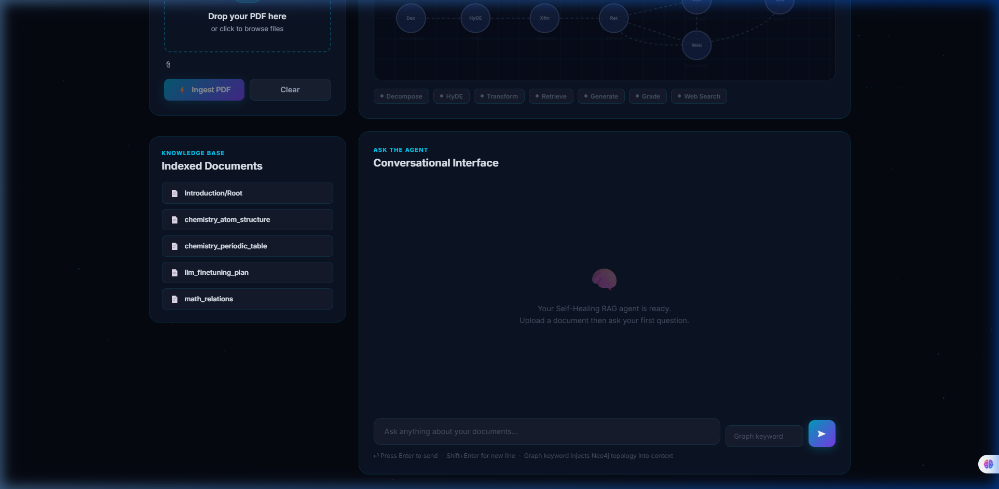
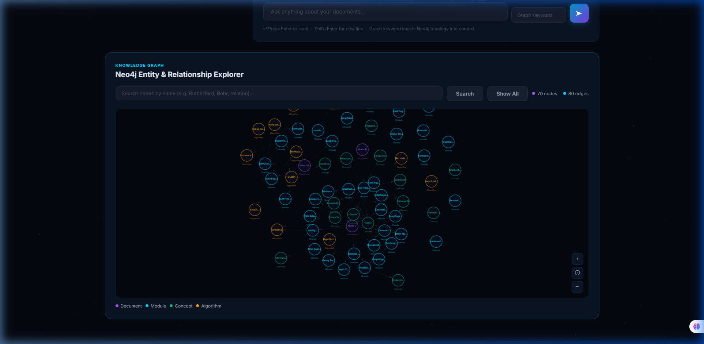
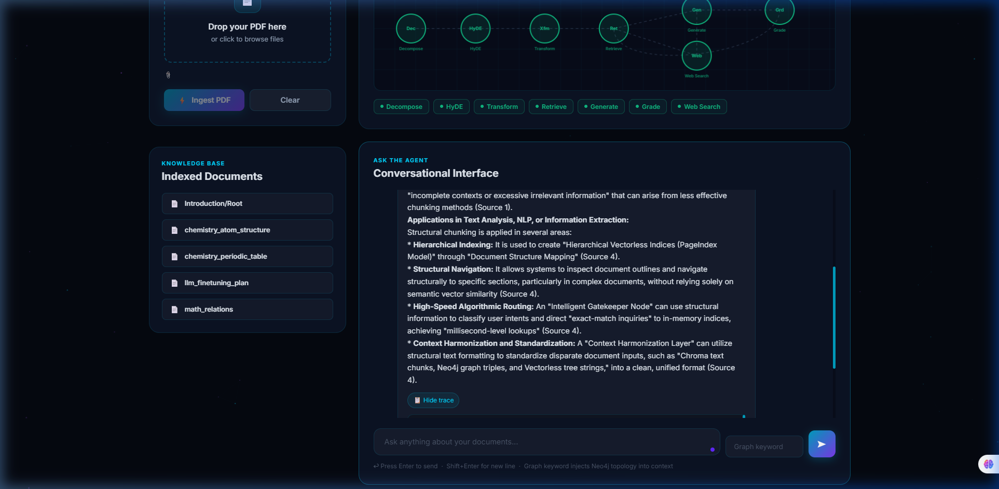
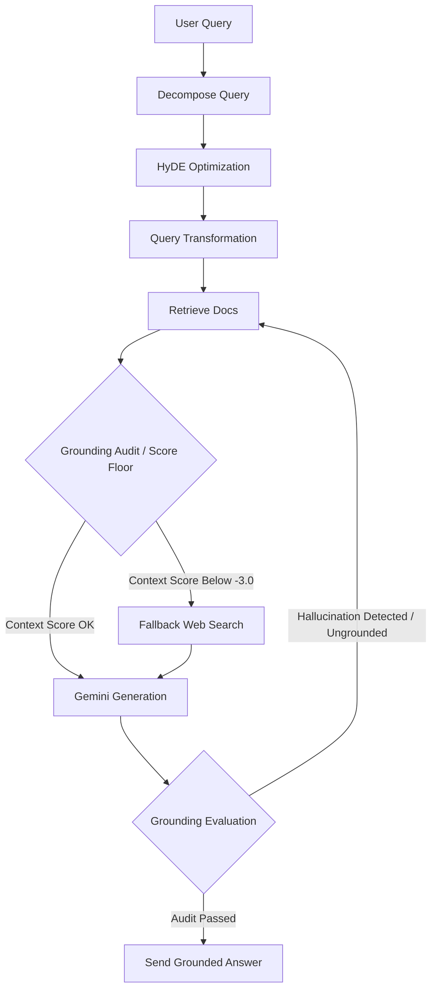

# Self-Healing Hybrid RAG System with Real-Time Intelligence Interface

An advanced, production-grade **Hybrid Retrieval-Augmented Generation (RAG)** system combining **vector search (Chroma DB)**, **knowledge graph traversal (Neo4j)**, and **lexical matching (RankBM25)** orchestrated via a self-healing state machine in **LangGraph**. It features a modern, real-time visual interface with particle backgrounds, dynamic workflow visualizers, and interactive force-directed graph diagrams.

---

## 📸 System Showcase

### 1. Main Dashboard & Knowledge Base Library
The control center displays the document ingestion portal (with drag-and-drop PDF upload) alongside the active database library, displaying currently indexed materials, and the conversational chatbot agent.


### 2. Interactive Neo4j Entity & Relationship Explorer
Visualize your knowledge base structure inside a force-directed SVG/Canvas graph. You can zoom, pan, hover to view entity tooltips, highlight connection types, drag to restructure, and click to pin/unpin nodes.


### 3. Self-Healing RAG Pipeline & Live Execution Trace
Watch the LangGraph workflow dynamically highlight active node passes (Decompose ➔ HyDE ➔ Transform ➔ Retrieve ➔ Grade ➔ Generate/Fallback) and inspect the step-by-step reasoning logs and execution trace.


---

## ⚡ Architectural Concept & Flow

This system operates on a dual-stage pipeline designed to deliver complete grounded accuracy with zero hallucinations:



1. **Ingestion Layer:** Reads PDFs with **Docling**, chunking documents structurally by section headers. Visual details, charts, and diagrams are handled through **Gemini multimodal vision models** and converted into base64 descriptions appended directly to text metadata.
2. **Hybrid Storage:** Text chunks are embedded using `gemini-embedding-2-preview` and indexed in a **Chroma DB** instance. Concurrently, a mining worker extracts key entities (`Concept`, `Module`, `Algorithm`) and relationships (`DEPENDS_ON`, `IMPLEMENTS`, `INTERACTS_WITH`) into **Neo4j**.
3. **LangGraph Workflow:** Executes a query optimization pipeline consisting of query decomposition, HyDE (Hypothetical Document Embeddings), and query transformations.
4. **Context Fusion Engine:** Combines retrieved Chroma vectors, Neo4j graph context (outgoing 1-hop facts matching query keywords), and high-speed lexical hits (via a local BM25 highway). Reranks them using a `cross-encoder/ms-marco-MiniLM-L-6-v2` encoder.
5. **Self-Healing Guardrails:** Audits generated answers against context. If the answer contains ungrounded claims (hallucinations) or context scores fall below `-3.0`, it loops back into retrieval or launches a **live DuckDuckGo web search fallback** to repair the response.

---

## 📂 Project Structure

```
├── api.py                      # FastAPI Backend Server & REST Endpoints
├── ask_hybrid_agent.py          # Production Hybrid Agent (Neo4j + LangGraph Orchestrator)
├── evaluate_rag.py              # Automated Evaluation Suite (Retrieval & Generation metrics)
├── eval_dataset.json            # Curated evaluation dataset questions
├── eval_report.md               # Summary metrics output report
├── frontend/
│   └── index.html               # Premium Dashboard UI (HTML5, CSS3, Canvas, Vanilla JS)
├── screenshots/                 # Captured system interface images
├── src/
│   ├── database/
│   │   ├── chroma_client.py     # Chroma Vector Store Handler
│   │   ├── extract_to_graph.py  # Neo4j Entity & Relationship Miner
│   │   ├── graph_client.py      # Neo4j Database Transaction Handler
│   │   └── init_graph.py        # Neo4j constraints & schema registry
│   ├── graph_engine/
│   │   ├── edges.py             # LangGraph routing & Grounding evaluation logic
│   │   ├── nodes.py             # Agent pipeline engines (HyDE, BM25, Web Search, Reranking)
│   │   ├── state.py             # LangGraph RAGState definition
│   │   └── workflow.py          # State-machine compiler & node wrappers
│   └── ingestion/
│       └── chunker.py           # Docling + Vision Multimodal Chunker
└── config/
    └── .env                     # Local Environment variables configuration
```

---

## 🛠️ Installation & Setup

### 1. Prerequisites
- **Python 3.11+**
- **Docker & Docker Compose** (for databases)
- **Google Gemini API Key**

### 2. Spin Up Database Infrastructure
Launch Chroma and Neo4j databases via docker-compose:
```bash
docker-compose up -d
```

### 3. Environment Configuration
Copy the example environment file and fill in your values:
```bash
cp config/.env.example config/.env
```
Edit `config/.env` with your Google Gemini API key and database credentials:
```env
GOOGLE_API_KEY=your_gemini_api_key_here
CHROMA_DB_PATH=./chroma_storage
CHROMA_HOST=localhost
CHROMA_PORT=8000
NEO4J_URI=neo4j://localhost:7687
NEO4J_USERNAME=neo4j
NEO4J_PASSWORD=password123
GENERATION_MODEL=gemini-2.5-flash
VISION_MODEL=gemini-2.5-flash
```

### 4. Install Dependencies
```bash
pip install -r requirements.txt
```

---

## 🚀 Running the System

### 1. Launch the Backend Server
Start the FastAPI backend server on port `8080`:
```bash
uvicorn api:app --port 8080 --host 0.0.0.0
```

### 2. Access the Intelligence Interface
Open your browser and navigate to:
```
http://localhost:8080/
```
From here you can:
- Upload any PDF document to run chunking, Chroma indexing, and Neo4j graph mining.
- View indexed documents.
- Click "Show All" or search in the Neo4j Explorer at the bottom to explore the knowledge graph.
- Ask questions and watch the live visualizer track LangGraph nodes in real-time.

### 3. Run RAG Evaluation Suite
We have included a metrics collector evaluating **Retrieval Quality** (Hit Rate, Mean Reciprocal Rank) and **Generation Quality** (Grounding Ratio, Self-Healing rate) across your indexed dataset:
```bash
python evaluate_rag.py
```
Outputs a summary report at `eval_report.md`.

---

## 🛡️ License
Designed for research and academic portfolio showcase. All rights reserved.
